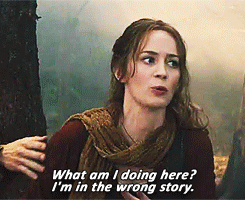

```{r setup, include=FALSE}
library(flexdashboard)
```

Column {data-width=650}
-----------------------------------------------------------------------
This is my example
with losts of text

### Chart A


```{r}

```

Column {data-width=350}
-----------------------------------------------------------------------
Here is a great resource

- some website
- some book 

### Chart B

```{r}

```

### Chart C

```{r}

```

